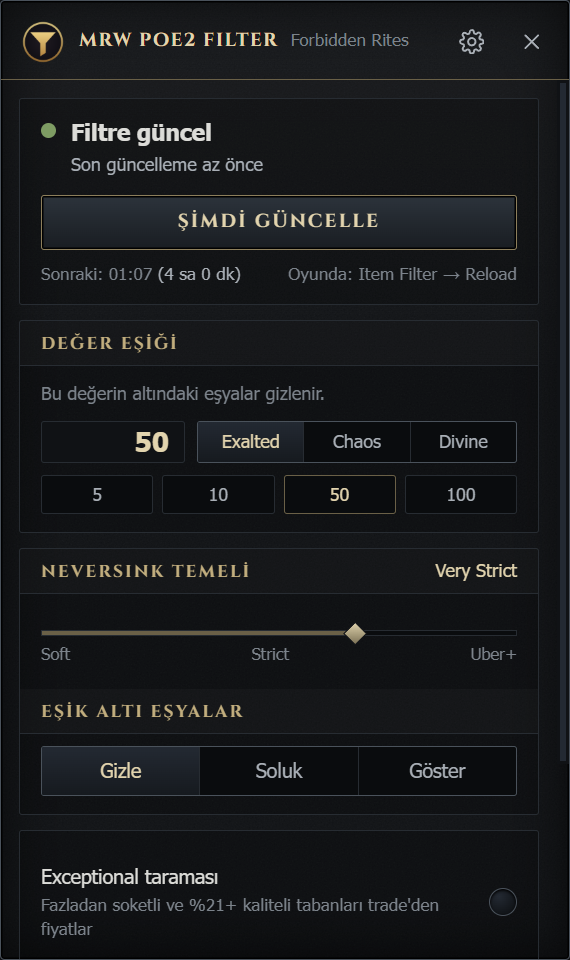
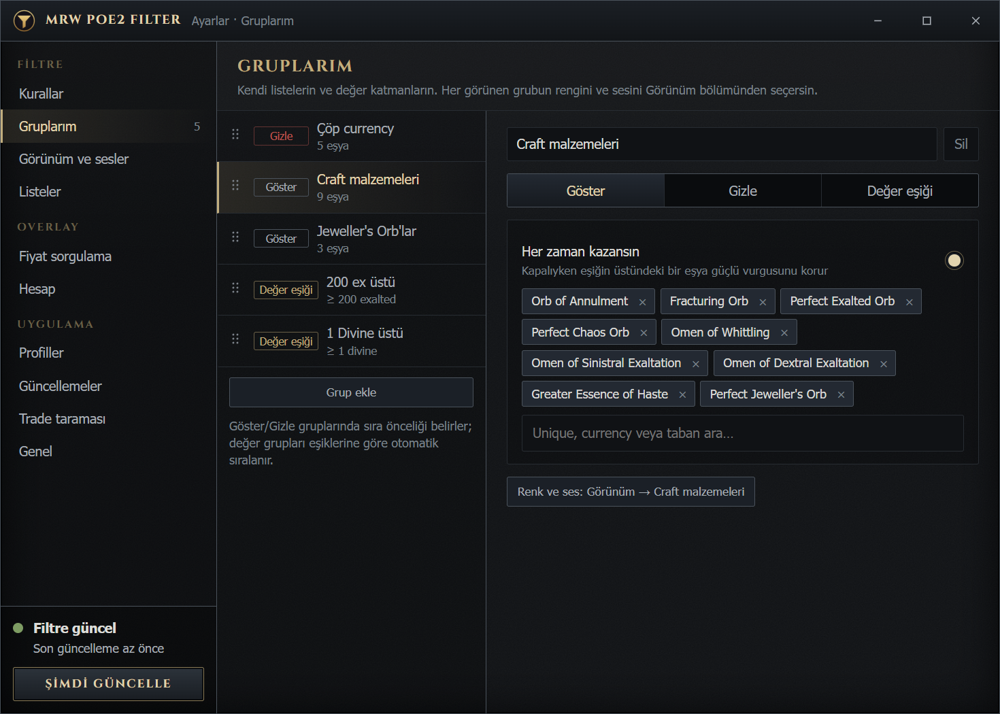
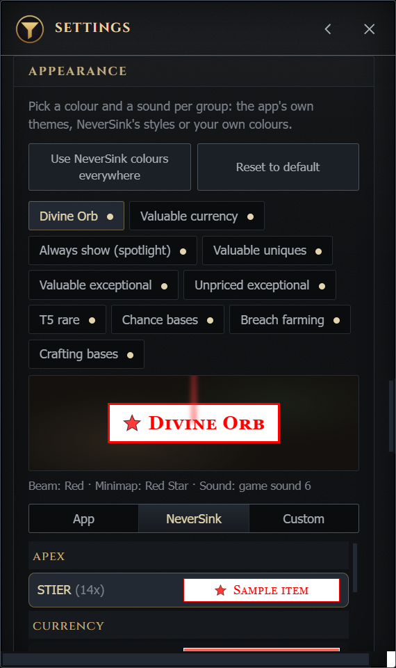
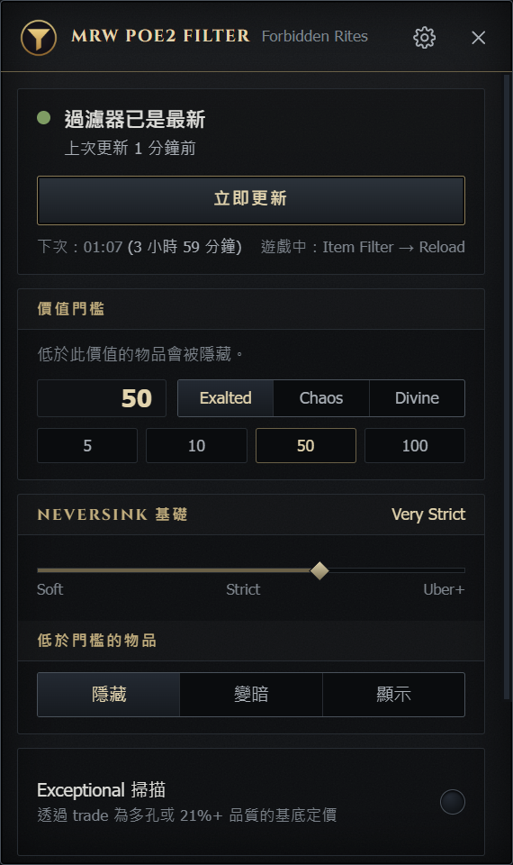

# MrW POE2 Filter

Sistem tepsisinde çalışan, NeverSink'in Path of Exile 2 loot filtresini **canlı piyasa fiyatlarıyla** güncelleyen masaüstü uygulaması (Wails v3 + Svelte).

<p align="center">
  
  
</p>

Bir değer eşiği belirlersin — örneğin 50 exalted. Uygulama piyasayı düzenli olarak tarar, eşiği geçen her şeyi yerde göze çarpacak şekilde işaretler, altında kalanları gizler veya soluklaştırır. Fiyatlar değiştikçe filtre kendi kendine güncellenir; lig ilerledikçe listeni elle düzeltmen gerekmez.

Fiyatlar nereden gelir:

- **Unique'ler** (poe.ninja): bir tabandaki en değerli unique eşiği geçiyorsa taban gösterilir; tek ilana dayanan fiyatlar gizleme sebebi olmaz.
- **Currency ve toplu eşyalar** (poe2scout): eşiğin altındakiler gizlenir veya soluklaştırılır.
- **Exceptional tabanlar** (resmi trade API): fazladan soketli veya %21+ kaliteli tabanlar arka planda, trade kotasının küçük bir payıyla fiyatlanır. *İleride bu tarama tek bir sunucu üzerinden yapılacak; uygulama fiyatları hazır alacak, kimse kendi kotasını harcamayacak.*
- **NeverSink** (MIT): seçtiğin strictness her güncellemede GitHub'dan indirilir, kurallar onun ilk bölümünden önce eklenir. Yani NeverSink'in tüm işi korunur, üstüne senin fiyat kuralların biner.

Uygulama oyun belleğini okumaz, oyuna girdi göndermez; yalnızca herkese açık fiyat kaynaklarını kullanır ve sonucu bir metin dosyasına yazar.

**Diller:** İngilizce, Türkçe ve Geleneksel Çince (繁體中文). Uygulama Windows'un dilini izler, Ayarlar → Genel → Dil'den değiştirebilirsin. Eşya ve currency adları her dilde İngilizce kalır, çünkü filtre eşyaları İngilizce adlarıyla tanır.

## İndirme ve kurulum

1. [Releases](../../releases/latest) sayfasından `poe2filtre-windows-amd64.exe` dosyasını indir. Kurulum gerekmez, tek dosya.
2. Çalıştır. Uygulama sistem tepsisine yerleşir; simgeye tıklayınca panel açılır, sağ tıkla menü çıkar.
3. Oyunda **Options → Item Filter** listesinden **auto_updated**'ı seç.

Exe imzasız olduğu için Windows SmartScreen "Windows bilgisayarınızı korudu" uyarısı gösterebilir: **Ek bilgi → Yine de çalıştır**. İndirdiğin dosyanın SHA-256 özeti release notlarında yazar, istersen karşılaştır.

Gereksinim: Windows 10/11 ve WebView2 (Windows 11'de yüklü gelir). Ayarlar ve veriler `%APPDATA%\PoE2Filtre` altında tutulur.

## İlk çalıştırmada ne olur

- Uygulama NeverSink filtresini ve güncel fiyatları indirir, birkaç saniye içinde filtreyi yazar: `Belgeler\My Games\Path of Exile 2\auto_updated.filter` (dosya adını ayarlardan değiştirebilirsin).
- **Oyun filtreyi kendiliğinden yeniden okumaz.** Her güncellemeden sonra oyunda Options → Item Filter → **Reload** demen gerekir.
- Exceptional taban taraması arka planda, yavaş yavaş ilerler: trade API'sinin kotasını zorlamamak için saatler sürer ve uygulama açık kaldıkça birikir. Panel ilk tam taramanın tahmini süresini gösterir. İlk gün eksik sonuç görmen normaldir; fiyatı bilinmeyen exceptional tabanlar gizlenmez, gösterilir.
- Sonraki güncellemeler varsayılan olarak 4 saatte bir kendiliğinden yapılır.
- **Yol haritası:** exceptional taraması ileride tek bir sunucuda toplanacak ve fiyatlar oradan dağıtılacak. O zaman ilk gün beklemesi de, trade kotası paylaşımı da ortadan kalkacak; şimdilik tarama her kullanıcının kendi makinesinde çalışıyor (sonuçları Ayarlar → Trade taraması'ndan dosyayla paylaşabilirsin).

## Ayarlar

Panelde, tepsi simgesine tıklayınca açılır.

| Bölüm | Ne yapar |
|---|---|
| **Değer eşiği** | Eşik ve birimi (exalted / chaos / divine). Altında kalan eşyalar gizlenir veya soluklaştırılır. |
| **NeverSink temeli** | Strictness seçimi (0 Soft … 6 Uber Plus Strict) veya kendi temel filtre dosyan. |
| **Ekipman** | Sıkı ekipman filtresi, tanımlanmamış rare ekipman ve rare jewel'lar için tier kaydıracı, yüksek kalite eşiği. |
| **Özel kurallar** | Waystone, uncut gem ve uncut support gem eşikleri (kaydıraçla; "Gösterme" ve "Hiçbiri" durakları dahil), pinnacle anahtarları; Exalted Orb ve altını gizleme. |
| **Listeler** | "Her zaman göster" (en güçlü vurgu) ve chance tabanları. Fiyattan bağımsız çalışır. |
| **Gruplarım** | Kendi listelerin ve değer katmanların, en fazla 12 tane. Bir grup eşyaları gösterebilir, gizleyebilir veya kendi Exalted/Chaos/Divine fiyat eşiğine ulaşan bütün fiyatlı eşyalara ayrı görünüm ve ses verebilir. |
| **Görünüm** | Her eşya grubu (yerleşik olanlar ve kendi grupların) için renk teması ve ses. Uygulamanın hazır temaları, NeverSink'in kendi 68 stili veya kendi renklerin — minimap simgesinin rengi ve şekli dahil. Değişiklikler panelde canlı önizlenir. |
| **Otomatik güncelleme** | Aralık (varsayılan 4 saat) ve bildirimler. Kapatırsan "Şimdi güncelle" ile elle çalıştırırsın. |
| **Uygulama güncellemeleri** | GitHub Releases'i günde bir denetler. Yeni exe'yi indirir, SHA-256 ile doğrular ve onayından sonra yeniden başlatarak güvenli biçimde değiştirir. |
| **Trade taraması** | Exceptional taban taramasını aç/kapat ve trade kotasının ne kadarını kullanacağını seç (%10–80, varsayılan %40). |
| **Profiller** | Farklı farm türleri için ayrı ayar setleri. Tek tıkla geçilir, yeniden adlandırılabilir, filtre hemen yeniden yazılır ve dosya olarak paylaşılabilir. |
| **Overlay** | İsteğe bağlı fiyat sorgulayıcı, **varsayılan olarak kapalı**. Açınca oyunda bir eşyanın üzerine gelip kısayola (varsayılan Alt+E) basarsın: küçük pencere eşyayı okur, affix, DPS, nadirlik ve özellikleri tıklanarak aramaya eklenip çıkarılabilir ve resmi trade sitesinde arar. ▣ düğmesi gelişmiş filtreli geniş pazarı açar. Pencereler oyun penceresinin içinde kalır ve başka uygulamaya geçince gizlenir. |
| **Genel** | Dil, lig, oyundaki filtre adı, filtre dosyasını dışa aktarma, filtre ve veri klasörleri. |

Ayarı değiştirdiğinde panel "Ayarlar değişti, filtreye yansıması için güncelle" der: önce **Güncelle**, sonra oyunda **Reload**.

<p align="center"></p>

## Sık karşılaşılanlar

**Filtrede hiçbir değişiklik göremiyorum.** İki adım da gerekli: uygulamada güncelleme, oyunda Options → Item Filter → Reload. Oyunu yeniden başlatmak gerekmez.

**Oyun açıkken çalışır mı?** Evet, tepside durur. Oyun belleğine dokunmaz, tuş/fare göndermez; sadece bir metin dosyası yazar.

**Tarama neden bu kadar uzun sürüyor?** Trade API'sinin kotasını zorlamamak için aramalar seyrek yapılıyor ve taranacak taban sayısı yüksek. Kalıcı çözüm yolda: tarama tek bir sunucuda yapılıp fiyatlar dağıtılacak, uygulama da onları hazır alacak. O güne kadar bir arkadaşının tarama sonuçlarını içe aktarman en hızlı yol.

**Trade taraması hesabımı riske atar mı?** Uygulama trade API'sini giriş yapmadan, oyunun ilan ettiği rate limit'lere uyarak ve kotanın yalnızca bir payıyla kullanır. Bu kota trade sitesini kendin kullanırken de ortaktır; aynı anda çok arama yapıyorsan tarama payını düşürebilirsin.

**Çok fazla şey gizleniyor / yeterince gizlenmiyor.** Önce değer eşiğini, sonra NeverSink strictness'ını oynat. İkisi birlikte çalışır: strictness tabanı belirler, eşik senin kurallarını.

**Tier ve seviye kaydıraçları nasıl çalışır?** Her kaydıracın soldan sağa üç tür durağı var:

1. **Gösterme** — o türün tamamı gizlenir.
2. **Hiçbiri** — uygulama hiçbir kural yazmaz, kararı NeverSink'in temel filtresi verir.
3. **Bir tier/seviye** — o eşik ve üstü gösterilir (waystone'da vurgulanır), altı gizlenir.

Örneğin waystone kaydıracı T14+ ise yalnızca T14 ve üstü vurgulanır; "Hiçbiri" dersen waystone'lara hiç karışılmaz; "Gösterme" dersen hepsi gizlenir. Uncut gem'lerde skill/spirit ve support için ayrı kaydıraç vardır, çünkü support gem'ler çok daha sık düşer.

**Belirli bir eşyayı hep görmek istiyorum.** Listeler → "Her zaman göster", ya da kendi grubunu kur: Gruplarım → Grup ekle. Yalnızca unique hâlini istiyorsan `Taban adı|unique` yazabilirsin.

**Bir grup kurdum ama eşya hâlâ eski rengiyle çıkıyor.** Eşya eşiğin üstündeyse güçlü "değerli" vurgusunu korur. Grubun rengi her koşulda kazansın istiyorsan o grubun "her zaman kazansın" anahtarını aç.

**Farklı fiyat seviyelerine farklı ses ve renk verebilir miyim?** Evet. Gruplarım → Grup ekle → **Değer eşiği** seç. Her grup için Exalted, Chaos veya Divine cinsinden ayrı eşik belirleyebilirsin. Uygulama güncel kurla eşikleri karşılaştırır; eşya geçtiği en yüksek grubun rengini, ışınını, minimap simgesini ve sesini alır. Ana eşikten düşük değer grupları uygulanmaz.

**Minimap simgesini nasıl değiştiririm?** Görünüm → grubu seç → **Özel** sekmesi: zemin, yazı, çerçeve, ışın rengi ve minimap simgesinin rengi ile şekli (yıldız, elmas, altıgen, artı…). Şekli seçmen yeterli, rengi kendiliğinden gelir.

**Renklerle oynadım, beğenmedim.** Görünüm bölümünde iki düğme var: "Varsayılana döndür" tüm grupların rengini ve sesini sıfırlar, "Tümünü NeverSink renklerine çevir" hepsini NeverSink'in kendi stillerine yaklaştırır.

**Oyun seslerini nasıl dinlerim?** Görünüm bölümünde sesin yanındaki oynat düğmesine bas. Oyunun 26 uyarı sesinin hepsi uygulamayla birlikte geliyor: 1–16 arası numaralı sesler ve 17–26 arası currency düşüş sesleri (Orb of Alchemy, Divine Orb, Mirror of Kalandra…). Bunlar Path of Exile'a ait, yalnızca ne seçtiğini duyman için var; filtreye yazılan şey değişmez, oyunda sesi yine oyun çalar. Ayrıntı için [NOTICE](NOTICE).

**Baştan başlamak istiyorum.** Uygulamadan çık ve `%APPDATA%\PoE2Filtre` klasörünü sil; uygulama bir sonraki açılışta varsayılan ayarlarla başlar.

**Farklı içerikler için farklı ayarlar istiyorum.** Ayarlar → Profiller. Şu ankini "Farklı kaydet" ile adlandır, ayarları değiştir, sonra listeden tek tıkla geç. Profil bütün ayarları taşır — lig ve oyundaki filtre adı dahil; filtre adı değişirse panel söyler, oyunda o filtreyi seçmen gerekir.

**Taramayı baştan beklemek istemiyorum.** [`paylasim/`](paylasim/) klasöründe tamamlanmış bir exceptional taraması (1203 anahtar, Forbidden Rites) ve örnek bir profil var. Taramayı Ayarlar → Tarama sonuçlarını paylaş → İçe aktar ile al; kendi taze kayıtların ezilmez, yalnızca eksik ya da daha eski olanlar güncellenir.

**Ayarlarımı arkadaşıma vermek istiyorum.** Profiller → Dışa aktar bir dosya çıkarır; arkadaşın İçe aktar ile alır ve o profille oynamaya başlar. Yalnızca üretilen filtreyi vermek istiyorsan Genel → "Filtre dosyasını dışa aktar" yeterli, karşı tarafın uygulamayı kurması bile gerekmez.

**Fiyat kaynağı çökerse ne olur?** Bir kaynak yanıt vermezse o kaynağın önceki verisi korunur ve filtre yine yazılır; zayıf veriyle (tek ilanlı unique, çok az ilanlı exceptional) hiçbir zaman gizleme yapılmaz.

## Diller

Arayüz, tepsi menüsü, bildirimler ve üretilen filtrenin içindeki yorum satırları üç dilde: **English**, **Türkçe**, **繁體中文**.

Varsayılan olarak Windows'un görüntü dili izlenir; Türkçe sistemde Türkçe, Çince (TW/HK) sistemde Geleneksel Çince, diğer her şeyde İngilizce açılır. Ayarlar → Genel → Dil'den elle seçebilirsin, seçim kaydedilir.

<p align="center"></p>

Eşya, currency ve filtre anahtar kelimeleri (Waystone, Exalted Orb, Uncut Support Gem…) her dilde İngilizce kalır: filtre dosyası eşyaları İngilizce adlarıyla tanıdığı için listelere de İngilizce yazılması gerekir.

Yeni bir dil eklemek istersen `frontend/src/lib/locales/en.ts` ve `internal/i18n/en.go` dosyalarını kopyalayıp çevirmen yeterli; `npm run check` ve `go test ./internal/i18n/` eksik veya fazla anahtarı söyler.

## Code signing policy

Bu bölüm [SignPath Foundation](https://signpath.org/) başvurusu için gereklidir ve İngilizce tutulmuştur. **Başvuru onaylanana kadar yayınlanan exe imzasızdır**; SmartScreen uyarısı bu yüzden çıkar.

Free code signing provided by [SignPath.io](https://signpath.io/), certificate by [SignPath Foundation](https://signpath.org/).

Team roles:

- Committers and reviewers: [kadircelebi](https://github.com/kadircelebi)
- Approvers: [kadircelebi](https://github.com/kadircelebi)

All releases are built from this repository by [GitHub Actions](.github/workflows/release.yml); no binary is produced on a developer machine.

### Privacy policy

This program will not transfer any information about the user to other networked systems.

To do its job it reads publicly available data: prices from [poe.ninja](https://poe.ninja/) and [poe2scout](https://poe2scout.com/), item listings from the official Path of Exile trade API, and NeverSink's filter from GitHub. These requests carry no account name, session or other identifying information, and the application never signs in. Settings stay in `%APPDATA%\PoE2Filtre`.

The price-check overlay is off by default. When the user turns it on and presses its shortcut over an item in the game, the application copies that item's text through the game's own copy command and sends a search built from its base type and modifiers to the official trade API. Nothing else the user enters in the app leaves their machine.

## Güncelleme ve kaldırma

Uygulama GitHub Releases'i günde bir kez denetler. Yeni sürüm varsa Ayarlar → **Uygulama güncellemeleri** bölümünden indirip kurabilirsin. Dosya GitHub'ın yayınladığı SHA-256 özetiyle doğrulanır; uygulama kapanır, exe'yi değiştirir ve yeniden açılır. Başlatma başarısız olursa önceki exe geri getirilir. Ayrı bir güncelleme sunucusu veya hesap gerekmez.

Güncelleyici ilk kez v1.8.0 ile geldiği için v1.7.0'dan v1.8.0'a geçiş bir kez elle yapılır; sonraki sürümler uygulama içinden kurulabilir.

Exe'nin bulunduğu klasöre yazma izni yoksa panel otomatik kurulum yerine release sayfasını açar; bu durumda yeni exe'yi uygulama kapalıyken elle eskisinin üstüne koy. Her iki yöntemde de ayarların `%APPDATA%\PoE2Filtre` altında durduğu için korunur.

Kaldırmak için: uygulamadan çık, exe'yi sil, `%APPDATA%\PoE2Filtre` klasörünü sil ve oyunda başka bir filtre seç. Yazılmış `auto_updated.filter` dosyası `Belgeler\My Games\Path of Exile 2` altında kalır, onu da silebilirsin.

## Derleme

Kendin derlemek istersen: yukarıdaki yeşil **Code → Download ZIP** ile (veya `git clone` ile) depoyu indir, klasördeki **`derle.bat`** dosyasına çift tıkla. Betik Go ile Node'un kurulu olduğunu doğrular, Wails CLI'si yoksa kendisi kurar ve `bin\poe2filter.exe` dosyasını üretir. İlk derleme birkaç dakika sürer.

Gerekenler: [Go](https://go.dev/dl/) 1.25+ ve [Node.js](https://nodejs.org/) 20+. Wails CLI'sini elle kurmak istersen: `go install github.com/wailsapp/wails/v3/cmd/wails3@v3.0.0-beta.23`.

Windows'un **Akıllı Uygulama Denetimi** (Smart App Control) açıkken kendi derlediğin imzasız exe çalıştırılamaz. Engellenirse Windows Güvenliği → Uygulama ve tarayıcı denetimi → Akıllı Uygulama Denetimi → Kapalı. (Bu ayar bir kez kapatılınca Windows sıfırlanmadan geri açılamaz; kapatmak istemiyorsan hazır exe'yi Releases'ten indir.)

Elle derlemek için:

```
wails3 build          # bin/poe2filter.exe
wails3 dev            # canlı geliştirme
go test ./internal/...
go run ./cmd/genicon  # simgeleri yeniden çiz
```

## Parametreler

| Parametre | |
|---|---|
| `-headless` | Arayüz açmadan bir kez güncelle ve çık |
| `-data <klasör>` | Ayar ve veri klasörü (varsayılan `%APPDATA%\PoE2Filtre`) |
| `-out <dosya>` | Filtreyi oyun klasörü yerine buraya yaz (test) |
| `-show` | Açılışta paneli göster |
| `-debug-port <n>` | WebView2 uzaktan hata ayıklama (geliştirme) |

## Yapı

| Klasör | Görev |
|---|---|
| `main.go`, `service.go` | Tepsi, panel penceresi, arayüze açılan API |
| `frontend/` | Svelte panel |
| `internal/engine` | Güncelleme akışı, zamanlayıcı, tarayıcı yönetimi (arayüzden bağımsız) |
| `internal/appupdate` | GitHub release denetimi, SHA-256 doğrulama ve geri alınabilir Windows exe değişimi |
| `internal/prices` | `prices.json` şeması: uygulama ile ileride sunucunun ortak sözleşmesi |
| `internal/collector` | poe.ninja + poe2scout → snapshot |
| `internal/trade` | Rate-limit uyumlu trade istemcisi ve exceptional tarayıcı |
| `internal/provider` | Fiyat kaynağı zinciri: sunucu (ileride) → yerel → önbellek |
| `internal/neversink` | NeverSink filtresini indirir, taban listelerini çıkarır |
| `internal/filter` | Kural üretimi ve enjeksiyon |

## Lisans

MIT, bkz. [LICENSE](LICENSE). Tek istisna `internal/gamesounds/files/` altındaki 26 uyarı sesi: onlar oyunun kendi ses dosyaları ve Grinding Gear Games'e aittir, MIT lisansının kapsamı dışındadır — bkz. [NOTICE](NOTICE). NeverSink'in filtresi ayrıca MIT lisanslıdır ve bu repoda dağıtılmaz; uygulama çalışırken [NeverSinkDev/NeverSink-Filter-for-PoE2](https://github.com/NeverSinkDev/NeverSink-Filter-for-PoE2) reposundan indirir. Fiyat verileri poe.ninja, poe2scout ve resmi trade API'sinden gelir. Bu proje Grinding Gear Games ile bağlantılı değildir.
